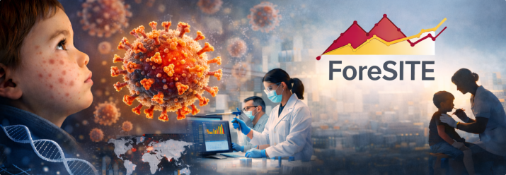

> [!CAUTION]
> Este README fue creado de manera automática a partir del README en inglés utilizando GitHub copilot. 

# Respuesta y herramientas para sarampión por ForeSITE

También disponible en: [🇺🇸 English](../README.md) | [🇨🇳 中文](../zh/README.md) | [🇮🇳 हिंदी](../hi/README.md)

Última actualización: 

Desde el inicio de los brotes de sarampión en Estados Unidos en 2025, ForeSITE (miembro de la red de modelación [InsightNet](https://insightnet.us/)) ha colaborado con departamentos de salud locales y estatales creando herramientas y análisis que apoyan la respuesta de salud pública. Una de las colaboraciones más cercanas ha sido con el Departamento de Salud y Servicios Humanos de Utah (Utah DHHS). Este repositorio contiene una lista de las herramientas y otros recursos que ForeSITE ha desarrollado. Al final de este archivo también encontrará enlaces a otros recursos creados por otros miembros de InsightNet.

Si tiene preguntas o desea colaborar con nosotros (o necesita ayuda usando cualquiera de estas herramientas), por favor escríbanos a george.vegayon@utah.edu o abra un issue en este repositorio.

## Herramientas y recursos de ForeSITE

1. **Simulador de brote en una sola escuela (aplicación Shiny)**: Como extensión del paquete [`epiworldRShiny`](https://cran.r-project.org/package=epiworldRShiny), desarrollamos una aplicación Shiny que permite simular brotes de sarampión en el entorno de una sola escuela. La aplicación corre dos escenarios: uno con cuarentena y otro sin cuarentena, y compara los resultados en términos de número de casos y hospitalizaciones. La aplicación está disponible [aquí](https://ggv.cl/shiny/measles).

2. **Simulador de brote en una sola escuela en R**: La aplicación Shiny es un contenedor del modelo `ModelMeaslesSchool` en el paquete [`measles`](https://cran.r-project.org/package=measles). El paquete `epiworldR` a su vez es un contenedor de la biblioteca en C++ `epiworld` ([enlace](https://github.com/UofUEpiBio/epiworld)), que provee el motor central de simulación para todos sus modelos.

3. **Cartas escolares sobre sarampión**: En estrecha colaboración con Utah DHHS, creamos un repositorio de plantilla que otros departamentos de salud pueden utilizar para generar cartas personalizadas con resultados de escenarios de nuestro simulador de brotes en una sola escuela. El repositorio plantilla, disponible [aquí](https://github.com/EpiForeSITE/measles-school-letters), utiliza un documento de [`quarto`](https://quarto.org/) para generar las cartas. Utah DHHS utilizó este documento para crear cartas personalizadas para escuelas en Utah y proporcionar información sobre posibles brotes de sarampión y el impacto de las medidas de cuarentena a los departamentos de salud locales.

4. **Modelo de mezcla con cuarentena**: Extendimos el modelo de una sola escuela para incluir múltiples escuelas (u otras entidades) a fin de evaluar el impacto de brotes de sarampión a nivel comunitario. El modelo está disponible en el paquete R `measles` como [`ModelMeaslesMixing()`](https://uofuepibio.github.io/measles/reference/ModelMeaslesMixing.html) e incluye un proceso de cuarentena mediante rastreo de contactos. La principal diferencia con el modelo de una sola escuela es que en dicho modelo todos los agentes no vacunados son puestos en cuarentena, mientras que en el modelo de mezcla solo se aíslan los contactos de los casos detectados.

5. **Nivel de cuarentena según riesgo de sarampión**: En respuesta a la pregunta sobre la duración óptima de la cuarentena tras una exposición a sarampión, desarrollamos un modelo, [`ModelMeaslesMixingRiskQuarantine()`](https://uofuepibio.github.io/measles/reference/ModelMeaslesMixingRiskQuarantine.html), que permite especificar distintas duraciones de cuarentena según niveles de riesgo: alto riesgo (mismo grupo que el caso reportado), riesgo medio (grupo distinto, pero con contacto directo) y bajo riesgo (grupo distinto, sin contacto directo). A la fecha del 29 de octubre de 2025, contamos con un informe con resultados preliminares de este modelo, disponible [aquí](https://github.com/EpiForeSITE/measles-tiered-quarantine).

6. **Modelos compartimentales estocásticos con múltiples grupos**: Similar al modelo de mezcla, un equipo liderado por el Dr. Damon Toth de la Universidad de Utah lanzó recientemente el paquete R [`multigroup.vaccine`](https://cran.r-project.org/package=multigroup.vaccine). Entre sus características, los autores crearon ejemplos aplicados a Short Creek en la frontera entre Utah y Arizona, utilizando datos de cobertura de vacunación de la región, así como información del Censo de EE. UU. Un análisis de ejemplo similar se puede encontrar en una de las viñetas del paquete R [`measles`](https://github.com/UofUEpiBio/measles).

Todos los modelos basados en agentes (ABM) listados aquí están disponibles en C++ en la biblioteca `epiworld` ([enlace](https://github.com/UofUEpiBio/epiworld)), en el paquete R `measles` (que envuelve `epiworld` a través de `epiworldR`), así como en Python en la biblioteca `epiworldpy` ([enlace](https://github.com/UofUEpiBio/epiworldpy)).

## Otros recursos de miembros de InsightNet

- Modelo compartimental para brotes escolares del grupo **epiENGAGE** ([enlace](https://epiengage-measles.tacc.utexas.edu/)).
- Hoja informativa de los CDC sobre sarampión ([enlace](https://www.cdc.gov/measles/data-research/index.html)).
- Kit de comunicación sobre sarampión del Departamento de Salud y Servicios Humanos de Texas ([enlace](https://www.dshs.texas.gov/vaccine-preventable-diseases/measles-rubeola/measles-communication-toolkit)).
- Simulador de sarampión del Centro para el Pronóstico y el Análisis de Brotes de los CDC ([enlace](https://cdcposit.cdc.gov/measles-simulator/)).
